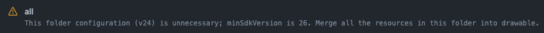
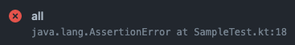

# Problem Matchers for Android

A collection of problem matchers for Android development.

> Currently, only Gradle builds are supported.

## Usage

Use this action before running gradle tasks. You can see how this shows the messages in [Matchers](#Matchers).

```
jobs:
  build:
    runs-on: ubuntu-latest
    steps:
      - uses: actions/checkout@v3
      - uses: actions/setup-java@v3
      - uses: jmatsu/android-problem-matcher@v1
      - run: ./gradlew ...
```

**Include all matchers**

Defaults inputs allow to include all supported matchers. This style automatically allows future problem matchers.

**Include the only specific matchers**

You can restrict matchers to include. This style automatically exclude future problem matchers.

```
jobs:
  build:
    runs-on: ubuntu-latest
    steps:
      - uses: actions/checkout@v3
      - uses: actions/setup-java@v3
      - uses: jmatsu/android-problem-matcher@v1
        with:
          matchers: <matchers you would like to include>
          # don't need to specify exclude input
      - run: ./gradlew ...
```

**Exclude the specific matchers**

You can exclude the specific matchers. This style automatically allows future problem matchers.

```
jobs:
  build:
    runs-on: ubuntu-latest
    steps:
      - uses: actions/checkout@v3
      - uses: actions/setup-java@v3
      - uses: jmatsu/android-problem-matcher@v1
        with:
          matchers: <matchers you would like to exclude>
          exclude: true
      - run: ./gradlew ...
```

# Matchers

## Kotlin Compiler

Matcher: `kotlin_gradle`
Severity: `Warning`, `Error`


## Android Lint

Matcher: `android_lint_gradle`
Severity: `Warning`, `Error`

Some Android Lint Issues do not have line information.





## JUnit test

Matcher: `junit_gradle`
Severity: `Error`


